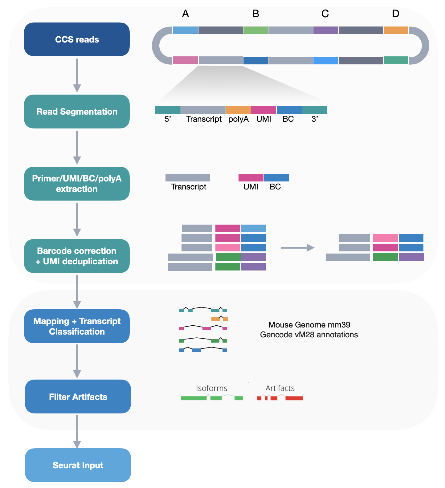
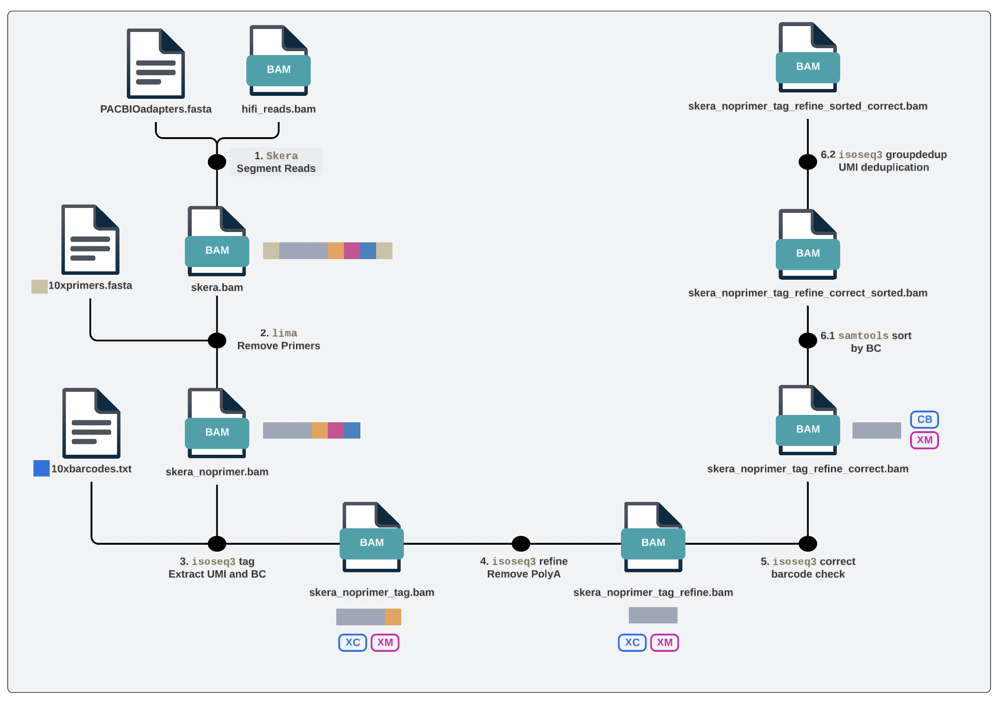
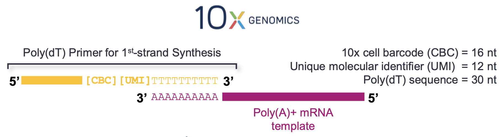
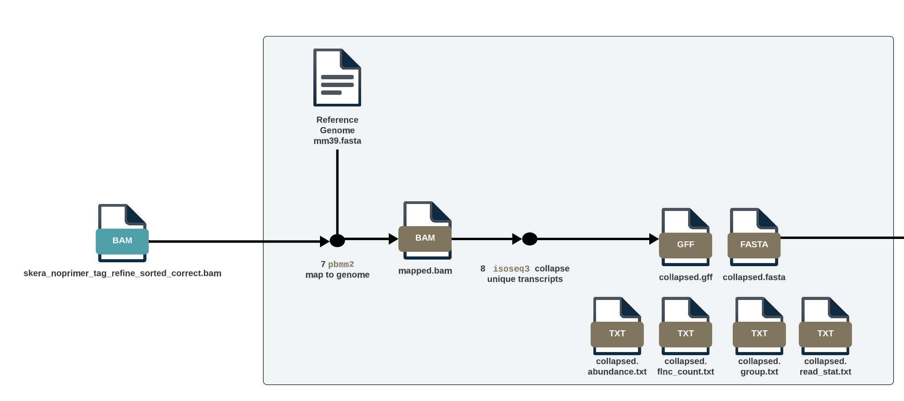
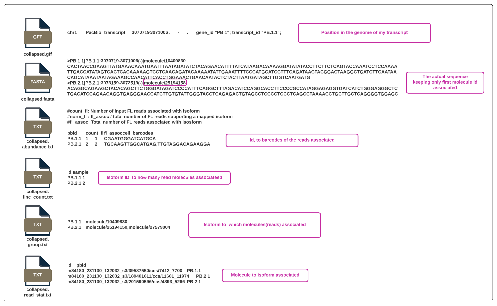
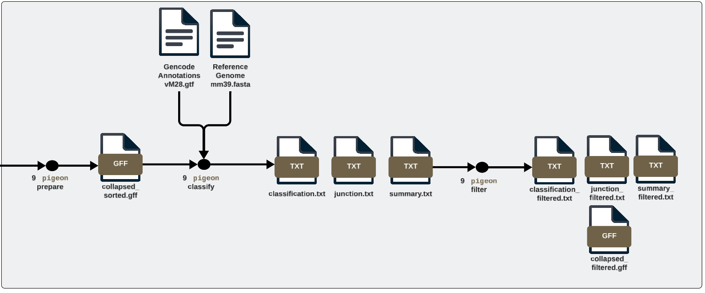

# PROCESSING LONG READS RNA-seq
## PACBIO MAS-SEQ DATA 




## RAW DATA 

1. `hifi_reads.bam` CCS reads: Circular Consensus Sequencing reads
2. `adapters.fasta` adapters used to concatenate reads


# Workflow
Followed https://isoseq.how/umi/cli-workflow.html

## Preprocessing: from CCS reads to FLNC reads


### 1. Read Segmentation `Skera`
```
skera split hifi_reads.bam adapters.fasta skera.bam
```

```
Input Reads	4,538,957
Segmented Reads (S-Reads)	65,071,392
Mean Length of S-Reads	667
Percentage of Reads with Full Array	83.4912
Mean Array Size (Concatenation Factor)	14.3362
```

### 2. Remove 5' and 3' 10x cDNA primers `lima`
https://lima.how/faq/isoseq

`primers.fasta` looks like:

```
>5p
AAGCAGTGGTATCAACGCAGAGTACATGGG
>3p
AGATCGGAAGAGCGTCGTGTAG
```

```
lima --isoseq --dump-clips [-j cpus] skera.bam primers.fasta output.bam
```


### 3. Extract UMI and cell barcodes `isoseq3`

https://pacbio.cn/wp-content/uploads/Technical-overview-MAS-Seq-library-preparation-using-MAS-Seq-for-10x-Single-Cell-3-kit.pdf


```
isoseq3 tag [-j cpus] output.5p--3p.bam output.5p--3p.tagged.bam --design T-12U-16B

```


### 4. Remove poly(A) tails and concatemer `isoseq3`
```
isoseq3 refine [-j cpus] \
     --require-polya \
     output.5p--3p.tagged.bam primers.fasta output.5p--3p.tagged.refined.bam 

```


### 5. Barcode correction `isoseq`


Depends on the chemistry of the single cell kit used. We used 3' v3 kit so we need the `3M-february-2018.txt.gz` https://kb.10xgenomics.com/hc/en-us/articles/360031133451-Why-is-there-a-discrepancy-in-the-3M-february-2018-txt-barcode-whitelist


Download from https://downloads.pacbcloud.com/public/dataset/IsoSeq_sandbox//10x_barcodes/ 

```
 isoseq3 correct --barcodes barcode_3M-february-2018-REVERSE-COMPLEMENTED.txt \
    ../4_isoseq_polyA/output.5p--3p.tagged.refined.bam \
    output.5p--3p.tagged.refined.corrected.bam

```

### 6. UMI deduplication (first sort by barcode) `isoseq3`

Sort by tag CB.  

```
samtools sort -t CB \
   -o output.5p--3p.tagged.refined.corrected.sorted.bam output.5p--3p.tagged.refined.corrected.bam

isoseq3 groupdedup \
   output.5p--3p.tagged.refined.corrected.sorted.bam \
   ../6_isoseq_umidedup/output.5p--3p.tagged.refined.corrected.sorted.dedup.bam
```


---
## Map and Collapse
https://isoseq.how/classification/workflow.html



### 7. Mapping to Genome


Reference: Mouse Genome mm39, with Gencode vM28 annotations

https://downloads.pacbcloud.com/public/dataset/MAS-Seq/REF-pigeon_ref_sets/Mouse_mm39_Gencode_vM28/


```

pbmm2 align \
       --sort --preset ISOSEQ \
       ../7_minimap/mouse_GRCm39.fasta \
       ../6_isoseq_umidedup/output.5p--3p.tagged.refined.corrected.sorted.dedup.bam \
       mapped.bam


samtools view -bS mapped.sam|samtools sort > mapped.bam
```

### 8. Collapse into Unique Transcripts `isoseq3`

```
isoseq3 collapse mapped.bam collapsed.gff
pigeon sort collapsed.gff -o collapsed.sorted.gff
```
Outputs:




📣📣📣  Open `collapsed.sorted.gff` in IGV and explore
BUT YOU NEED TO REMOVE FIRST 3 LINES OF COMMENTS, IGV doesnt like comments!!!! 


---
## Transcript Classification

Two approches 
- `PIGEON` (still classifies intronic as intergenic but the seurat input is easier to make 🙂)
- `SQANTI3` (need to use cDNACUPCAKE to make seurat input)



## `Pigeon`
### 9.1.1 Prepare .gff `Pigeon`
```
pigeon prepare collapsed.gff
```

### 9.1.2 Classify Transcripts  `Pigeon`
```
pigeon classify ../8_isoseq_collapsetranscripts/collapsed.sorted.gff \
gencode.vM28.annotation.sorted.gtf \
mouse_GRCm39.fasta \
--cage-peak refTSS_v3.3_mouse_coordinate.mm10.sorted.bed \
--poly-a polyA.list.txt \
--fl ../8_isoseq_collapsetranscripts/collapsed.abundance.txt
```


### 9.1.3 Filter Artifacts  `Pigeon`
```
pigeon filter collapsed_classification.txt --isoforms \
../8_isoseq_collapsetranscripts/collapsed.sorted.gff
```

## `SQANTI3`

### 9.2.1 Classify Transcripts `sqanti3`
https://github.com/ConesaLab/SQANTI3/wiki/Tutorial:-running-SQANTI3-on-an-example-dataset

```
python SQANTI3/sqanti3_qc.py\
      ../8_isoseq_collapsetranscripts/collapsed.sorted.gff \
     gencode.vM28.annotation.sorted.gtf \
     mouse_GRCm39.fasta \
     -fl ../8_isoseq_collapsetranscripts/collapsed.abundance.txt -t 32 --report both -o annotated9 \
     --genename \
     --isoAnnotLite \
```

### 9.2.2 Filter Transcripts `sqanti3`
https://github.com/ConesaLab/SQANTI3/wiki/Running-SQANTI3-filter


```
python SQANTI3/sqanti3_filter.py rules \
      ../9_sqanti/annotated9_classification.txt \
      --isoAnnotGFF3 ../9_sqanti/annotated9.gff3 \
      --isoforms ../9_sqanti/annotated9_corrected.fasta \
      --gtf ../9_sqanti/annotated9_corrected.gtf \
      -o filtered10 \
      -d ../9_sqanti_filter/ \
```

### 9.2.3 Manually filtered all entries classified as "Artifact" in `_RulesFilter_result_classification.txt`
```
grep -v 'Artifact' filtered10_RulesFilter_result_classification.txt > filtered_classification.txt
```


## 10. Seurat Input

If you want to keep novel genes add `--keep-novel-genes`

```
pigeon make-seurat --dedup ../6_isoseq_umidedup/output.5p--3p.tagged.refined.corrected.sorted.dedup.fasta \
   --group ../8_isoseq_collapsetranscripts/collapsed.group.txt \
    -d ../10_seurat_pigeon \
    collapsed_classification.filtered_lite_classification.txt

```


## RESOURCES
PacBio Glossary  https://www.pacb.com/wp-content/uploads/2015/09/Pacific-Biosciences-Glossary-of-Terms.pdf

Sample prep https://pacbio.cn/wp-content/uploads/Technical-overview-MAS-Seq-library-preparation-using-MAS-Seq-for-10x-Single-Cell-3-kit.pdf ⭐️⭐️⭐️

Workflow https://github.com/Magdoll/cDNA_Cupcake/wiki/Iso-Seq-Single-Cell-Analysis:-Recommended-Analysis-Guidelines ⭐️⭐️⭐️

https://isoseq.how/clustering/examples.html

Tutorial SQANTI QC  https://www.youtube.com/watch?v=TTjDAwuhB68&t=483s 

UC Davis Workshop https://ucdavis-bioinformatics-training.github.io/2021-August-Iso-Seq/

Records https://video.ucdavis.edu/media/2020_September_IsoSeq_part2/1_xvb9cr8c

MAS iso seq vs ISO seq https://www.psomagen.com/blog/transcriptomics-discoveries-mas-seq-iso-seq

ARTIFACTS https://www.pacb.com/wp-content/uploads/Single-Cell-Iso-Seq-Library-Preparation-Using-SMRTbell-Express-Template-Prep-Kit-2.0-Customer-Training.pdf ⭐️⭐️⭐️


